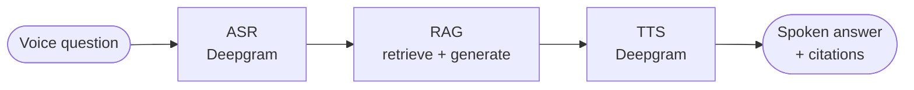

# Ask the Book — Voice-Grounded PDF Q&A

Upload a PDF book, ask a question out loud, and get a spoken answer grounded in
the document — with clickable citations back to the exact chapter and page.

The pipeline is **ASR → RAG → TTS**: your speech is transcribed, a
retrieval-augmented pipeline finds the relevant passages and generates a grounded
answer, and the answer is read back to you. The retrieval design follows
Anthropic's Contextual Retrieval and adds chapter-aware structure, so answers are
genuinely usable rather than approximate.

> Built as a take-home for the Wiz.ai AI Builder Intern role.

---

## Contents

- [Highlights](#highlights)
- [Demo](#demo)
- [How it works](#how-it-works)
- [Quickstart](#quickstart)
- [Usage](#usage)
- [Testing & evaluation](#testing--evaluation)
- [Documentation](#documentation)
- [Project layout](#project-layout)

---

## Highlights

- **Voice in, voice out.** Ask by microphone in the browser; hear the answer
  spoken back, with the transcript and citations shown on screen.
- **Retrieval that actually works.** Contextual Retrieval + parent-child chunking
  + hybrid (dense + BM25) search + Reciprocal Rank Fusion + cross-encoder
  reranking. Not naive fixed-size chunks.
- **Verifiable grounding.** Every answer cites the chapter and page it came from,
  using the language model's native citations.
- **Knows what it doesn't know.** Out-of-scope questions get an honest "the book
  doesn't cover that" instead of a hallucinated answer.
- **Upload any book.** Chapters are detected by font size, with no hard-coded
  titles, so it works on documents it has never seen.
- **Measured, not asserted.** A RAGAS-style evaluation harness scores retrieval
  and answer quality with numbers (see [Testing](#testing--evaluation)).

---

## Demo

A short demo video accompanies this submission, walking through an upload, a
spoken question, the grounded spoken answer, and an out-of-scope question. The
[Usage](#usage) section below describes the same flow step by step, and
[ARCHITECTURE.md](docs/ARCHITECTURE.md) shows what happens behind each step.

---

## How it works



The retrieval pipeline — the part that determines answer quality — is:

```
question -> dense + BM25 search -> Reciprocal Rank Fusion
         -> cross-encoder rerank -> expand to parent passages
         -> Claude with native citations -> grounded answer
```

For the full picture (system context, container diagram, ingestion and query
flows, and the retrieval pipeline in detail) see
**[docs/ARCHITECTURE.md](docs/ARCHITECTURE.md)**. For *why* each choice was made,
see the **[Architecture Decision Records](docs/adr/)**.

---

## Quickstart

**Prerequisites:** Python 3.12+, Node 18+, and two API keys
([Anthropic](https://console.anthropic.com/) and
[Deepgram](https://console.deepgram.com/) — Deepgram has $200 of free credit).

### 1. Backend

```bash
cd backend
python3 -m venv .venv
.venv/bin/pip install -r requirements.txt

cp .env.example .env        # then paste your keys into .env
```

Start the API:

```bash
.venv/bin/python -m uvicorn app.api:app --port 8000
```

The first start downloads the cross-encoder reranker weights (a few hundred MB),
so give it a moment. `GET http://localhost:8000/health` should return
`{"status":"ok"}`.

### 2. Frontend

```bash
cd frontend
npm install
npm run dev
```

Open the URL Vite prints (typically `http://localhost:5173`).

---

## Usage

1. **Add a book.** Upload a PDF (a sample, `samples/world-lighthouses.pdf`, is
   included — a 12-chapter book that indexes in seconds). Indexing runs in the
   background with a progress indicator.
2. **Ask a question.** Click the microphone and speak, or type it. Try
   *"Which lighthouse first used a revolving Fresnel lens?"*
3. **Get a grounded answer.** The answer is read aloud and shown on screen with
   citations you can click to see the source chapter and page.
4. **Try an out-of-scope question** (e.g. *"How tall is the Burj Khalifa?"*) to
   see the system decline honestly rather than guess.

Two sample books are bundled in [`samples/`](samples/): a short 12-chapter
lighthouse field guide (fast to index, good for a quick demo) and *The Adventures
of Sherlock Holmes* (a full-length book).

---

## Testing & evaluation

```bash
cd backend
.venv/bin/python -m pytest -q          # 14 unit tests (parser + chunker)
.venv/bin/python -m eval.run_eval      # answer-quality evaluation (needs Anthropic key)
```

The evaluation harness runs a hand-written question set through the real pipeline
and scores **context recall, answer correctness, faithfulness, and out-of-scope
accuracy**. The full strategy and the latest results are in
**[docs/TESTING.md](docs/TESTING.md)**.

---

## Documentation

| Document | What's in it |
|---|---|
| [docs/ARCHITECTURE.md](docs/ARCHITECTURE.md) | System context, containers, ingestion and query flows, the retrieval pipeline in detail (C4 + Mermaid diagrams). |
| [docs/adr/](docs/adr/) | Architecture Decision Records — every significant choice with its context and consequences. |
| [docs/TESTING.md](docs/TESTING.md) | The four-layer testing strategy and the answer-quality evaluation results. |
| [docs/AI_WORKFLOW.md](docs/AI_WORKFLOW.md) | How this was built with an AI assistant, and where human judgment overruled it. |

---

## Project layout

```
.
├── backend/            FastAPI backend (the RAG pipeline + voice)
│   ├── app/            parser, chunker, contextualizer, indexer,
│   │                   retriever, answerer, voice, api, library
│   ├── eval/           answer-quality evaluation harness + question set
│   ├── tests/          unit tests (parser + chunker)
│   └── scripts/        sample-PDF generators + API smoke test
├── frontend/           React + Vite app (upload, mic, playback, citations)
├── samples/            demo PDFs (the single place a human adds books)
└── docs/               architecture, ADRs, testing, AI workflow
```

---

## A note on keys and limits

API keys live in `backend/.env`, which is gitignored — never commit keys.
Uploads are capped (size and page count) to guard against a runaway indexing job;
the limits are in `backend/app/config.py`.
