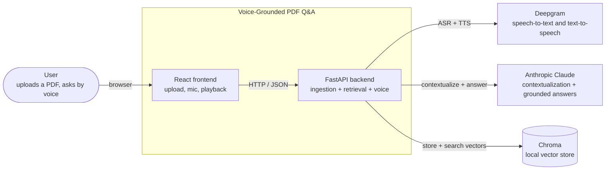
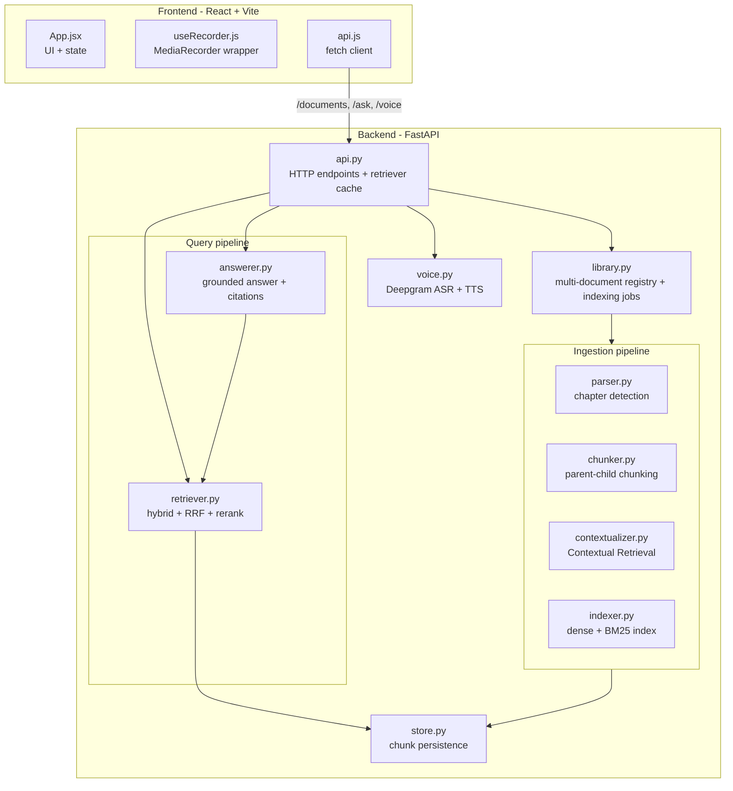
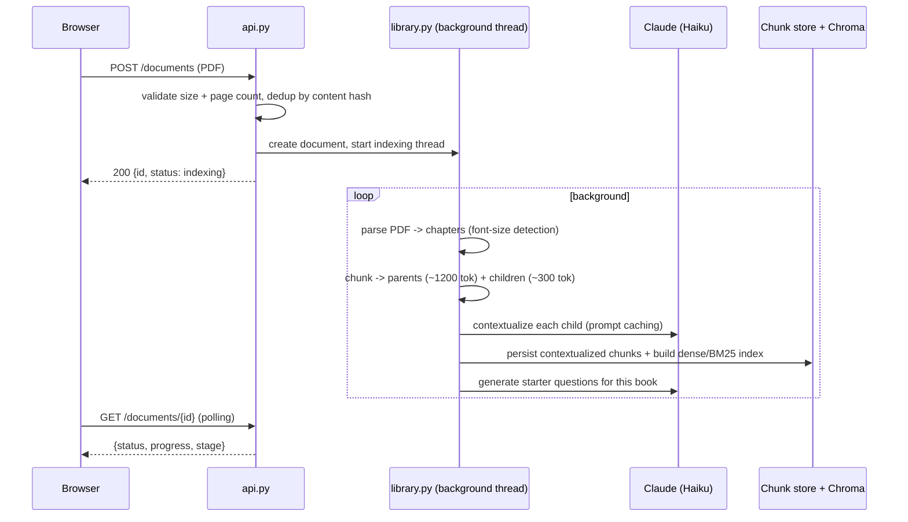
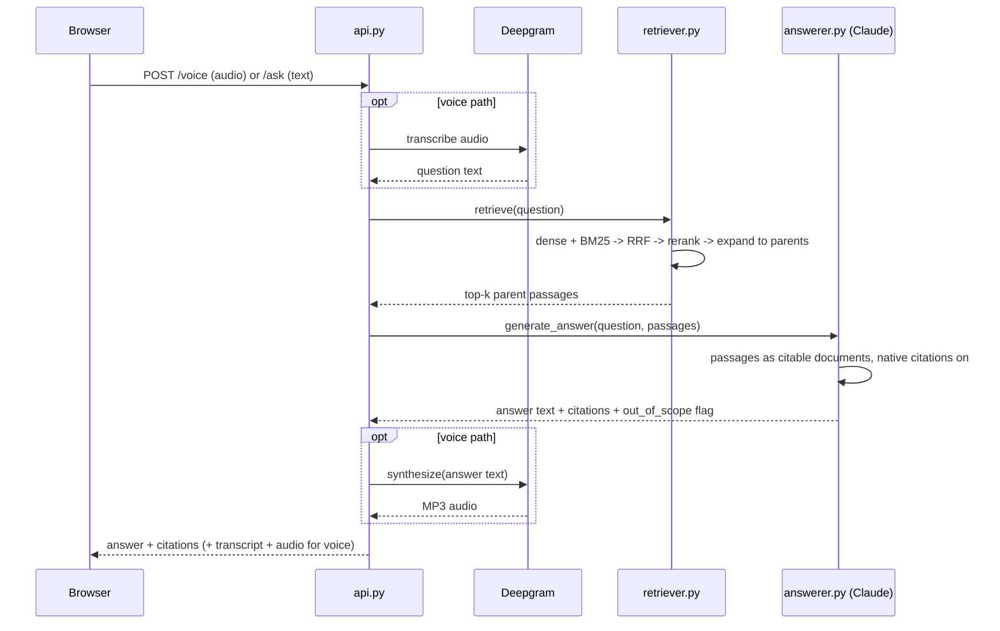
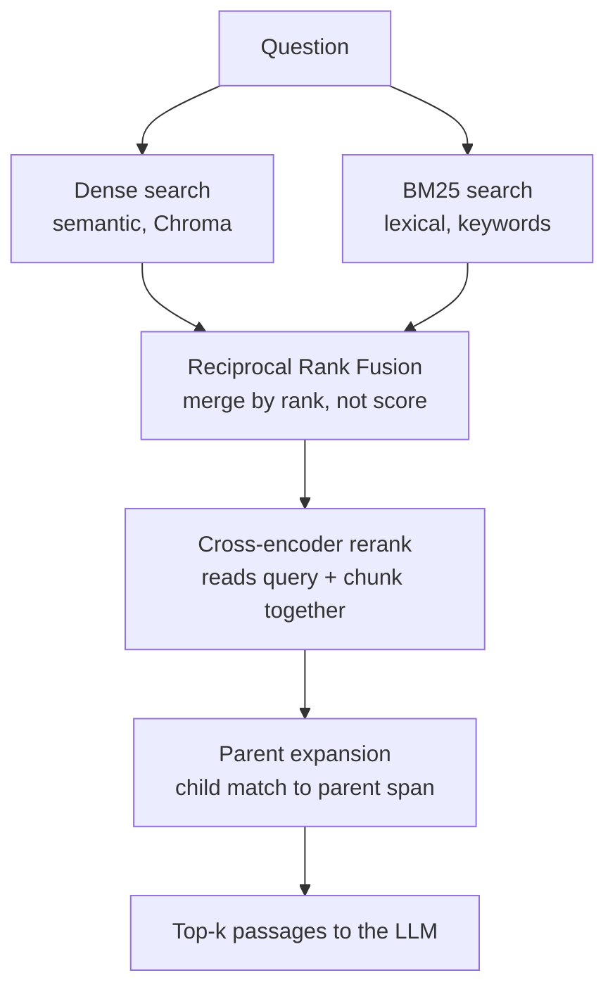

# Architecture

This document explains how the system is built and why it is shaped the way it
is. It covers the high-level structure, the two flows that matter most (indexing
a book and answering a question), and how the retrieval pipeline is put together.

For the *why* behind individual technology choices, see the
[Architecture Decision Records](./adr/). For how it is tested, see
[TESTING.md](./TESTING.md).

---

## 1. System context

At the highest level, the application sits between a person with a PDF and three
external AI services. The user never talks to those services directly; the
backend orchestrates them.

The boundary that matters: **everything grounded happens server-side.** The
browser records audio and plays it back, but transcription, retrieval, answer
generation, and synthesis all run in the backend, where the document index and
API keys live.

---

## 2. Containers

One level down, the backend is a single FastAPI process with clearly separated
modules. There is no microservice split because the workload does not need one;
the separation is by *responsibility within one process*, which keeps the system
simple to run (`uvicorn app.api:app`) while still being easy to reason about.

| Module | Responsibility |
|---|---|
| `api.py` | HTTP surface; owns the per-document retriever cache and request validation. |
| `library.py` | Tracks every uploaded book in a JSON registry; runs indexing in a background thread with progress reporting. |
| `parser.py` | Detects chapter boundaries from the PDF using font size, with no hard-coded titles. |
| `chunker.py` | Produces small "child" chunks for matching and larger "parent" spans for context. |
| `contextualizer.py` | Prepends an LLM-generated situating sentence to each chunk (Anthropic Contextual Retrieval). |
| `indexer.py` | Builds the dense (Chroma) and lexical (BM25) indexes over the contextualized text. |
| `retriever.py` | Hybrid search, Reciprocal Rank Fusion, cross-encoder reranking, parent expansion. |
| `answerer.py` | Sends retrieved passages to Claude with native citations enabled; detects out-of-scope questions. |
| `voice.py` | Deepgram speech-to-text and text-to-speech over REST, behind a pluggable synthesizer interface. |
| `store.py` | Reads and writes the contextualized chunks as JSON, one file per document. |

---

## 3. Flow A — Ingesting a book

Indexing is the expensive, one-time step. It runs in a background thread so the
upload request returns immediately and the UI can poll for progress. The output
is a per-document chunk store plus a Chroma collection that the query pipeline
later reads.

The four ingestion stages, in order:

1. **Chapter detection (`parser.py`).** Headings are set in a larger font than
   body text, so the parser measures per-character font sizes and treats lines
   that are at least four points larger than the body as chapter headings. This
   works on any book without a list of expected titles. Wrapped headings are
   reassembled; lone numerals from scene breaks are ignored.

2. **Parent-child chunking (`chunker.py`).** Each chapter is split into small
   child chunks (~300 tokens) and larger parent spans (~1200 tokens). The
   children are what we search; the parents are what the language model reads.
   This resolves the tension between precise matching and sufficient context —
   see [ADR-0003](./adr/0003-parent-child-chunking.md).

3. **Contextualization (`contextualizer.py`).** A small model (Claude Haiku)
   writes a one-line situating sentence for each chunk ("This passage is from the
   chapter on the Eddystone lighthouse and describes its 1882 granite rebuild")
   and prepends it before indexing. Prompt caching makes this cheap: the chapter
   text is cached once and reused across all of that chapter's chunks. See
   [ADR-0002](./adr/0002-contextual-retrieval.md).

4. **Indexing (`indexer.py`).** The contextualized text is written into both a
   Chroma vector collection (for semantic search) and an in-memory BM25 index
   (for keyword search).

---

## 4. Flow B — Answering a question

Both the text path (`/ask`) and the voice path (`/voice`) share the same
retrieval and generation core. Voice simply wraps it with transcription on the
way in and synthesis on the way out.

The retriever is loaded once per document and cached (`RetrieverCache` in
`api.py`), so repeated questions against the same book reuse the same in-memory
index and the same cross-encoder. The cross-encoder itself is a process-wide
singleton, warmed at startup so the first question does not stall while model
weights load.

---

## 5. The retrieval pipeline in detail

This is the part the assignment weighs most heavily ("naive fixed-size chunking
has limited recall; research current methods"). The design follows Anthropic's
**Contextual Retrieval** work and adds structure the generic approach cannot
assume — namely that a book has chapters and pages.

Every stage below is a known, measurable improvement over naive top-k vector
search:

1. **Hybrid search.** Dense (vector) search matches meaning and handles
   paraphrase; BM25 matches exact words and nails rare proper nouns. They fail in
   opposite ways, so running both and combining them beats either alone.

2. **Reciprocal Rank Fusion.** The two result lists use incomparable score
   scales (cosine similarity vs BM25 score), so they are merged by *rank*
   instead: `score(d) = Σ 1 / (k + rank(d))` with `k = 60`. A passage ranked
   highly by either method floats up; one ranked highly by both wins.

3. **Cross-encoder reranking.** First-pass retrieval uses fast bi-encoder
   vectors, which embed the query and the chunk separately. A cross-encoder
   instead reads the (query, chunk) pair *together* and scores true relevance —
   slower, so it is only run on the fused shortlist, but far more accurate for
   picking the final handful.

4. **Parent expansion.** We matched on small child chunks for precision, but the
   language model receives each child's larger parent span so it has enough
   surrounding context to answer well.

The selected passages are then handed to Claude as citable `document` blocks with
native citations enabled, so every sentence in the answer can be traced back to a
specific chapter and page. See [ADR-0004](./adr/0004-hybrid-search-rrf-rerank.md)
and [ADR-0005](./adr/0005-grounded-answers-native-citations.md).

---

## 6. Key cross-cutting decisions

- **Multi-document isolation.** Each book gets its own Chroma collection
  (`doc_<id>`) and its own chunk file, so books never bleed into each other's
  answers and one can be deleted cleanly.
- **Background indexing with a registry.** A JSON registry tracks every book and
  its status; indexing runs off the request thread; orphaned jobs from a crash
  are recovered on the next startup.
- **Pluggable voice.** Text-to-speech sits behind a small interface so the voice
  provider can be swapped without touching the pipeline.
- **Concurrency safety.** The registry is guarded by a lock and written
  atomically (temp file + rename) so concurrent uploads cannot corrupt it.
